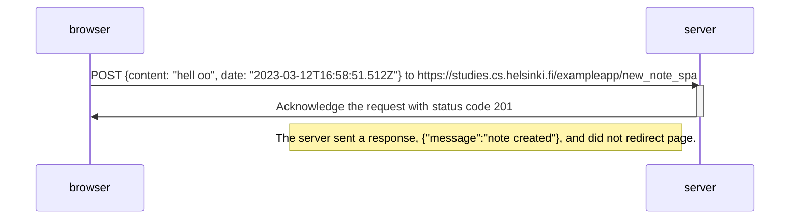

Exercise 0.6

```mermaid
sequenceDiagram
    participant browser
    participant server
    
    browser->>server: POST {content: "hell oo", date: "2023-03-12T16:58:51.512Z"} to https://studies.cs.helsinki.fi/exampleapp/new_note_spa
    activate server
    server->>browser: Acknowledge the request with status code 201
    deactivate server
    Note left of server: The server sent a response, {"message":"note created"}, and did not redirect page.
```